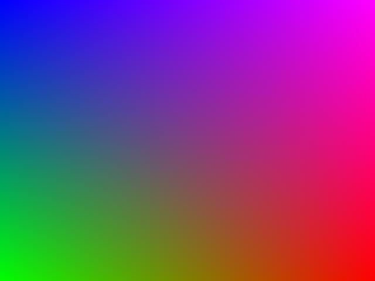

# RGB

```lua
function rgb(n,m)
  local x = n / dgfx.width
  local y = m / dgfx.height
  return x, (1 - x) * y, 1 - y
end
```

# Interference stripes

```lua
function rgb(n,m)
  local x = n / dgfx.width
  local y = m / dgfx.height
  local f1 = math.sin(30 * x + 10 * y)
  local f2 = math.sin(40 * x - 15 * y)
  local r = (f1 + 1) * 0.5
  local g = (f2 + 1) * 0.5
  local b = (math.sin(60 * (x * x + y * y)) + 1) * 0.5
  return r, g, b
end
```

# Radial ripples

```lua
function rgb(n,m)
  local cx = dgfx.width * 0.5
  local cy = dgfx.height * 0.5
  local dx = (n - cx) / dgfx.width
  local dy = (m - cy) / dgfx.height
  local r = math.sqrt(dx*dx + dy*dy)
  local wave = 0.5 + 0.5 * math.cos(40 * r - 6 * r*r)
  return wave, wave * 0.6 + 0.2, 1 - wave
end
```

# Complex

```lua
function rgb(n,m)
  local x = map(n, 0, dgfx.width, -2.5, 2.5)
  local y = map(m, 0, dgfx.height, -2, 2)
  local zx, zy = x, y
  local x2 = zx*zx - zy*zy
  local y2 = 2*zx*zy
  local x3 = x2*zx - y2*zy
  local y3 = x2*zy + y2*zx
  local fx = x3 - 1 / (zx + 0.2)
  local fy = y3
  local arg = math.atan2(fy, fx)
  local mag = math.sqrt(fx*fx + fy*fy)
  local hue = (arg / (2*math.pi) + 1) % 1
  local val = 1 - (math.log(mag + 1) / 6)
  local r,g,b = hsv2rgb(hue, 0.9, clamp(val,0,1))
  return r, g, b
end
```

# Mandelbrot

```lua
function rgb(n,m)
  local cx = map(n, 0, dgfx.width, -2.5, 1)
  local cy = map(m, 0, dgfx.height, -1.2, 1.2)
  local zx, zy = 0, 0
  local maxIter = 100
  local iter = 0
  while iter < maxIter do
    local x2 = zx*zx - zy*zy + cx
    local y2 = 2*zx*zy + cy
    zx, zy = x2, y2
    if zx*zx + zy*zy > 4 then break end
    iter = iter + 1
  end
  if iter == maxIter then
    return 0, 0, 0
  else
    local mag = math.sqrt(zx*zx + zy*zy)
    local mu = iter + 1 - math.log(math.log(mag)) / math.log(2)
    local hue = (mu / maxIter) % 1
    local r,g,b = hsv2rgb(hue, 0.8, 0.9)
    return r, g, b
  end
end
```

# Julia

```lua
function rgb(n,m)
  local zx = map(n, 0, dgfx.width, -1.5, 1.5)
  local zy = map(m, 0, dgfx.height, -1.5, 1.5)
  local cx, cy = -0.7, 0.27015
  local maxIter = 150
  local iter = 0
  while iter < maxIter do
    local x2 = zx*zx - zy*zy + cx
    local y2 = 2*zx*zy + cy
    zx, zy = x2, y2
    if zx*zx + zy*zy > 4 then break end
    iter = iter + 1
  end
  local t = iter / maxIter
  local r,g,b = hsv2rgb((0.6 + t*2) % 1, 0.8, clamp(0.3 + t*0.7,0,1))
  return r, g, b
end
```

# Fake 3D

```lua
function rgb(n,m)
  local x = map(n, 0, dgfx.width, -1, 1)
  local y = map(m, 0, dgfx.height, -1, 1)
  local cx, cy, r = 0, 0, 0.6
  local dx, dy = x - cx, y - cy
  local d = math.sqrt(dx*dx + dy*dy)
  local inside = d < r
  local nn = clamp((r - d) / r, 0, 1)
  local lightx, lighty, lightz = 0.5, 0.5, 0.8
  local nz = math.sqrt(clamp(1 - (d/r)*(d/r), 0, 1))
  local nx = dx / r
  local ny = dy / r
  local lam = clamp(nx*lightx + ny*lighty + nz*lightz, 0, 1)
  local base = 0.2 + 0.8 * lam
  if not inside then base = 0.05 end
  return base*1.0, base*0.7, base*0.4
end
```
